# 数据库基础操作语句

## 用户

```mysql
-- 查询用户
USE mysql;
SELECT * FROM user;
-- 创建用户
CREATE USER '用户名'@'主机名(%表示任意主机)' 
IDENTIFIED BY '密码';

-- 修改用户密码
ALTER USER '用户名'@'主机名' IDENTIFIED WITH mysql_native_password BY '新密码';

-- 删除用户
DROP USER '用户名'@'主机名';

```


------


## 权限

| 权限                | 说明               |
| ------------------- | ------------------ |
| ALL, ALL PRIVILEGES | 所有权限           |
| SELECT              | 查询数据           |
| INSERT              | 插入数据           |
| UPDATE              | 修改数据           |
| DELETE              | 删除数据           |
| ALTER               | 修改表             |
| DROP                | 删除数据库/表/视图 |
| CREATE              | 创建数据库/表      |


```mysql
数据库或表名中使用 * 为通配符

-- 查询权限
SHOW GRANTS FOR '用户名'@'主机名';

-- 授予权限
GRANT 权限列表 ON 数据库名.表名 TO '用户名'@'主机名';

-- 撤销权限
REVOKE 权限列表 ON 数据库名.表名 FROM '用户名'@'主机名';
```


------


## 数据库

```mysql
-- 创建数据库
CREATE DATABASE [IF NOT EXISTS] 数据库名 [DEFAULT CHARSET 字符集] [COLLATE 排序规则];

-- 删除数据库
DROP DATABASE [IF EXISTS] 数据库名;

-- 使用数据库
USE 数据库名;

-- 显示所有数据库（权限内的）
show databases;

-- 查询当前数据库
SELECT DATABASE();
```


------


## 表

### 表和字段

#### 查询

```mysql
-- 查询当前数据库所有表
SHOW TABLES;

-- 查询表结构
DESC 表名;

-- 查询指定表的建表语句
SHOW CREATE TABLE 表名;


```


#### 创建

```mysql
-- 表创建
CREATE TABLE 表名(
    字段1 字段类型 [COMMENT 字段1注释],
    字段2 字段类型 [COMMENT 字段2注释],
    字段3 字段类型 [COMMENT 字段3注释],
    ...
    字段n 字段类型 [COMMENT 字段n注释](最后一个字段后面不能有逗号)
)[COMMENT 表注释];
```


#### 修改

```mysql
-- 添加字段
ALTER TABLE 表名 ADD 字段名 类型(长度) [COMMENT 注释] [约束];

-- 修改字段类型
ALTER TABLE 表名 MODIFY 字段名 新字段类型(长度);

-- 修改字段名和字段类型
ALTER TABLE 表名 CHANGE 旧字段名 新字段名 类型(长度) [COMMENT 注释][约束];

-- 修改表名
ALTER TABLE 表名 RENAME TO 新表明;
```


#### 删除

```mysql
-- 删除字段
ALTER TABLE 表名 DROP 字段名;

-- 删除表
DROP TABLE [IF EXISTS] 表名;

-- 删除指定表，并重新创建该表
TRUNCATE TABLE 表名;
```


### 表中数据

#### 查询

```mysql
SELECT 字段列表
FROM 表名列表
WHERE 条件列表
GROUP BY 分组字段列表
HAVING 分组后条件列表
ORDER BY 排序字段列表
LIMIT 分页查询
```

##### 条件

| 比较运算符          | 功能                                     |
| ------------------- | ---------------------------------------- |
| >                   | 大于                                     |
| >=                  | 大于等于                                 |
| <                   | 小于                                     |
| <=                  | 小于等于                                 |
| =                   | 等于                                     |
| <> 或 !=            | 不等于                                   |
| BETWEEN ... AND ... | 在范围内                                 |
| IN(...)             | 在()列表值内, 多选一                     |
| LIKE 占位符         | 模糊匹配(_匹配一个字符, %匹配任意个字符) |
| IS NULL             | 是NULL                                   |

| 逻辑运算符 | 功能 |
| ---------- | ---- |
| AND 或 &&  | 并且 |
| OR 或 \|\| | 或者 |
| NOT 或 !   | 不是 |

##### 执行顺序

| 编写顺序 | 执行顺序 |
| -------- | -------- |
| SELECT   | FROM     |
| FROM     | WHERE    |
| WHERE    | GROUP BY |
| GROUP BY | HAVING   |
| HAVING   | SELECT   |
| ORDER BY | ORDER BY |
| LIMIT    | LIMIT    |


#### 插入

```mysql
-- 指定字段添加数据(批量)
INSERT INTO 表名 (字段1, 字段2, ...) VALUES (值1, 值2, ...),[(值1, 值2, ...),(值1, 值2, ...),];

-- 全部字段添加数据
-- 上面的语句不要填写字段名
```


#### 更新

```mysql
UPDATE 表名 SET 字段1=值1, 字段2=值2, ... [WHERE 条件];
```


#### 删除

```mysql
DELETE FROM　表名　[WHERE 条件];
```


------

### 多表查询

多表关系基本分为三种：一对多、多对多、一对一

- 一对多（多对一）

​	   在多的一方建立外键，指向一的方向的主键

- 多对多

​		建立中间表，至少包含两个外键，分别关联两方主键

- 一对一

​		一对一多用于单表的拆分，将一张表的基础字段放在一张表中，其他详情		字段放在另一张表中，以提升操作效率

​		在任意一方加入外键，关联另一方的主键，并且设置外键为唯一的

​		(UNIQUE)

#### 联合查询 -union, union all

联合查询就是把多次查询的结果合并起来，形成一个新的查询结果集

```mysql
SELECT 字段列表 FROM 表A ...
UNION [ALL]
SELECT 字段列表 FROM 表B ...

-- union all不会去重，union会去重
-- 多张表的列数和字段类型需要保持一致
```

这是一个索引查询优化，如果用==or==会导致索引失效，效率降低


#### 子查询

子查询的外部语句可以是 INSERT/UPDATE/DELETE/SELECT 的任意一个

- 标量子查询（子查询结果为单个值）
- 列子查询（子查询结果为一列）
- 行子查询（子查询结果为一行）
- 表子查询（子查询结果为多行多列）

 根据子查询位置，分为：WHERE之后，FROM之后，SELECT之后

##### 标量子查询

子查询返回的结果通常是单个值（数字、字符串、日期等），最简单的形式，这种子查询称为标量子查询

常用操作符：＝　＜＞　＞　＞＝　＜　＜＝


##### 列子查询

子查询返回的结果通常是一列（可以是多行），这种子查询称为**列子查询**

常用操作符：

| 操作符 | 描述                                 |
| ------ | ------------------------------------ |
| IN     | 在指定的集合范围之内，多选一         |
| NOT IN | 不在指定的集合范围之内               |
| ANY    | 子查询返回列表中，有任意一个满足即可 |
| SOME   | 与ANY等同                            |
| ALL    | 子查询返回列表的所有值都必须满足     |


##### 行子查询

子查询返回的结果通常是一行（可以是多列），这种子查询称为**行子查询**

```mysql
select * from *** where (列1, 列2) = (子查询)
```


##### 表子查询

子查询返回的结果通常是多行多列

常用 IN

```mysql
select * from *** where (列1, 列2) I (子查询)
```


------

## 事务

```mysql
-- 查看事务自动提交
SELECT @@autocommit; -- 0 关闭  1 开启
-- 设置事务自动提交关闭
SET @@autocommit = 0;
```

**并发事务问题**

| 问题       | 描述                                                         |
| ---------- | ------------------------------------------------------------ |
| 脏读       | 一个事务读到另一个事务还没有提交的数据                       |
| 不可重复读 | 一个事务先后读取同一条数据，但两次读取的数据不同，称为不可重复读 |
| 幻读       | 一个事务按照条件查询数据时，没有对应的数据行，但是在插入数据的时候又发现数据已存在 |

**事务隔离级别**

| 隔离级别                | 脏读 | 不可重复读 | 幻读 |
| ----------------------- | ---- | ---------- | ---- |
| Read uncommitted        | ✔    | ✔          | ✔    |
| Read committed          | ✘    | ✔          | ✔    |
| Repeatable Read（默认） | ✘    | ✘          | ✔    |
| Serializable            | ✘    | ✘          | ✘    |

- √表示在当前隔离级别下该问题会出现
- Serializable 性能最低；Read uncommitted 性能最高，数据安全性最差

```mysql
-- 查看隔离级别
SELECT @@TRANSACTION ISOLATION;

-- 设置隔离级别
SET [SESSION|GLOBAL] TRANSACTION ISOLATION LEVEL {Read uncommitted | Read committed | Repeatable Read | Serializable}
```


------


## 内置函数

### 字符串函数

| 函数                       | 功能                                                        |
| -------------------------- | ----------------------------------------------------------- |
| CONCAT(S1, S2, ... Sn)     | 字符串拼接                                                  |
| LOWER(str)                 | 将字符串str全部转为小写                                     |
| UPPER(str)                 | 将字符串str全部转为大写                                     |
| LPAD(str, n, pad)          | 左填充，用字符串pad对str的左边进行填充，达到n个字符串长度   |
| RPAD(str, n, pad)          | 右填充，用字符串pad对str的右左边进行填充，达到n个字符串长度 |
| TRIM(str)                  | 去掉字符串头部和尾部的空格                                  |
| SUBSTRING(str, start, len) | 返回字符串str从start位置起的len长度的字符串                 |


### 数值函数

| 函数        | 功能                               |
| ----------- | ---------------------------------- |
| CEIL(x)     | 向上取整                           |
| FLOOR(x)    | 向下取整                           |
| MOD(x)      | 返回x/y的模                        |
| RAND()      | 返回0~1内的随机数                  |
| ROUND(x, y) | 求参数x的四舍五入的值，保留y位小数 |


### 日期函数

| 函数                               | 功能                                              |
| ---------------------------------- | ------------------------------------------------- |
| CURDATE()                          | 返回当前日期                                      |
| CURTIME()                          | 返回当前时间                                      |
| NOW()                              | 返回当前日期和时间                                |
| YEAR(date)                         | 获取指定date的年份                                |
| MONTH(date)                        | 获取指定date的月份                                |
| DAY(date)                          | 获取指定date的日期                                |
| DATE_ADD(date, INTERVAL expr type) | 返回一个日期/时间值加上一个时间间隔expr后的时间值 |
| DATEDIFF(date1, date2)             | 返回起始时间date1和结束时间date2之间的天数        |

```mysql
-- DATE_ADD(date, INTERVAL expr type)
SELECT DATE_ADD(NOW(),INTERVAL 70 DAY)
-- type可选值：DAY, MONTH, YEAR, WEEK, SECOND, MINUTE, HOUR

-- DATEDIFF(date1, date2)
select datediff('2021-01-01', '2021-02-01')
-- -31 (负数可知是date1减date2)

```


### 流程函数

| 函数                                                       | 功能                                                     |
| :--------------------------------------------------------- | -------------------------------------------------------- |
| IF(value, t, f)                                            | 如果value为true， 则返回t，否则返回f                     |
| IFNULL(value1, value2)                                     | 如果value1不为空，返回value1,否则返回value2              |
| CASE WHEN [val1] THEN [res1] ... ELSE [default] END        | 如果val1为true,返回res1, ... 否则返回default默认值       |
| CASE [expr] WHEN [val1] THEN [res1] ... ELSE [default] END | 如果expr的值等于val1,返回res1, ... 否则返回default默认值 |

```mysql
-- ifnull()
select IFNULL(NULL, "DEFAULT") -- DEFAULT

-- CASE [expr] WHEN [val1] THEN [res1] ... ELSE [default] END
-- 返回员工的姓名和工作地点，如果为（北京/上海）->一线城市，否则->二线城市
select 
	name,
	case workaddress when '北京' then '一线城市'
					 when '上海' then '一线城市'
					 else '二线城市' end
FROM emp;
```


------


## 约束

约束是作用于表中字段上的规则，用于限制存储在表中的数据。

目的是保证数据库中数据的正确、有效性和完整性。

| 约束                       | 描述                                                     | 关键字      |
| :------------------------- | :------------------------------------------------------- | :---------- |
| 非空约束                   | 限制该字段的数据不能为null                               | NOT NULL    |
| 唯一约束                   | 保证该字段的所有数据都是唯一、不重复的                   | UNIQUE      |
| 主键约束                   | 主键是一行数据的唯一标识、要求非空且唯一                 | PRIMARY KEY |
| 默认约束                   | 保存数据时，如果未指定该字段的值，则采用默认值           | DEFAULT     |
| 检查约束（8.0.16版本之后） | 保证字段值满足某一个条件                                 | CHECK       |
| 外键约束                   | 用来让两张表的数据之间建立连接，保证数据的一致性和完整性 | FOREIGN KEY |


**外键约束**

> 不建议使用数据库外键，应在代码中使用逻辑实现外键

```mysql
-- 创建表时添加外键
CREATE TABLE 表名(
	字段名 数据类型;
    ...
    [CONSTRAINT] [外键名称] FOREIGN KEY (外键字段名) REFERENCES 主表(主表列名)
);


-- 表已存在时
ALTER TABLE 表名 ADD CONSTRAINT 外键名称 FOREIGN KEY (外键字段名) REFERENCES 主表(主表列名) ON UPDATE [CASCADE] ON DELETE [CASCADE];

-- 删除外键
ALTER TABLE 表名 DROP FOREIGN KEY 外键名称;

```

**更新行为**

| 行为        | 说明                                                         |
| ----------- | ------------------------------------------------------------ |
| NO ACTION   | 当在父表中删除/更新对应记录时，首先检查该记录是否有对应外键，如果有则不允许删除/更新。(与RESTRICT一致) |
| RESTRICT    | 与NO ACTION一致                                              |
| CASCADE     | 当在父表中删除/更新对应记录时，首先检查该记录是否有对应外键，如果有，则也删除/更新外键在子表中的记录 |
| SET NULL    | 当在父表中删除对应记录时，首先检查该记录是否有对应外键，如果有则设置子表中该外键值为null（这就要求该外键允许取null) |
| SET DEFAULT | 父表有变更时，子表将外键列设置成一个默认的值(Innodb不支持)   |


------

# MySQL进阶

## 索引

索引的目的在于使用空间换取查询时间

- 单列索引：一个索引只包含单个列
- 联合索引：一个索引有多个列


**创建索引**

```mysql
CREATE [UNIQUE|FULLTEXT] INDEX index_name ON table_name (index_col_name,...);

-- 例:
-- 普通索引(可指定索引排序类型)
CREATE INDEX idx_user_name ON tb_user(name [asc|desc], ...);
-- 唯一索引
CREATE UNIQUE INDEX idx_user_phone ON tb_user(phone);
-- 联合索引
CREATE INDEX idx_user_user_pro_age_sta ON tb_user(profession, age, status);
```

**查看索引**

```mysql
SHOW INDEX FROM table_name;
```

**删除索引**

```mysql
DROP INDEX index_name ON table_name;
```


## 性能分析

### **查看数据库操作次数**

```mysql
-- 查看全局操作次数
SHOW GLOBAL STATUS LIKE 'Com_______'; -- 7个_
```

### [慢查询日志](#慢查询日志（进阶）)

```mysql
-- 慢查询日志开关
SHOW VARIABLES LIKE 'slow_query_log';
set global slow_query_log=1;
-- 慢查询日志超时时长
show variables like 'long_query_time';
set global long_query_time=5;
```

开启慢查询日志

在mysql（/etc/my.cnf）配置文件中

```bash
# 开启慢查询日志
slow_query_log=1
# 设置慢日志时间为2秒，SQL查询时间超过2秒就会被视为慢查询，记录慢查询日志(默认10秒)
long_query_time=2
```

### profile分析

```mysql
SELECT @@have_profiling;
SELECT @@profiling;
SET profiling=1;

# 查看每一条sql的耗时基本情况
show profiles;

# 查看指定query_id的sql语句各个阶段的耗时情况
show profile for query_id;

# 查看指定query_id的sql语句的cpu使用情况
show profile cpu for query_id;
```

### explain 执行计划

```mysql
-- 在SELECT前加上 EXPLAIN / DESC
EXPLAIN SELECT 字段列表 FROM 表名 WHERE 条件;
```

**执行计划各字段含义**

| 字段名       | 含义                                                         |
| ------------ | ------------------------------------------------------------ |
| Id           | select查询的序列号，表示查询中执行select子句或者是操作表的顺序(id相同，执行顺序从上到下，id不同，值越大越先执行) |
| select_type  | 表示SELECT类型，常见的取值有SIMPLE(简单表，即不使用表连接或者子查询)、PRIMARY(主查询，即外层的查询)、UNION(UNION中的第二个或者后面的查询语句)、SUBQUERY(子查询)等 |
| type         | 表示连接类型，性能由好到差的连接类型为NULL，system，const，eq_ref，ref，range，index，all |
| possible_key | 可能命中的索引                                               |
| key          | 实际用到的索引，如果为NULL则未使用索引                       |
| key_len      | 使用到的索引的字节数，该值为索引字段最大可能长度，并非实际使用长度，在不损失精确性的前提下，长度越短越好 |
| rows         | MySQL认为必须要执行查询的行数，在innodb引擎的表中，是一个估计值，不总是准确的 |
| filtered     | 返回结果的行数占需读取行数的百分比，值越大越好               |

- 关于[type类型详解](https://www.cnblogs.com/myseries/p/11251667.html)可点击查看


## 索引使用

### **最左前缀法则**

- 如果索引使用了多列（联合索引），要遵守最左前缀法则。最左前缀法则指的是查询从索引的最左列开始，并且不跳过索引中的列。==即最左边的列必须存在==

```mysql
-- 假设表中有如下索引
-- id PRIMARY
-- phone 
-- name 
-- |profession  1|
-- |age			2|联合索引
-- |status		3|
... where profession='xx' and age=31 and status='0' -- 命中（与列顺序无关）
... where profession='xx' and age=31 -- 命中
... where profession='xx' -- 命中
... where age=31 and status='0' -- 不命中
... where status='0' -- 不命中
```


### 索引失效情况

- 如果跳跃某一列，==索引将部分失效（后面的字段索引失效）==
- 在联合索引中，出现范围查询 (>, <, !=, <>) ，查询范围右侧的列索引失效（>=, <= 会命中索引，所以在业务条件允许的情况下尽量使用>=, <=）
- in在小范围时不会导致索引失效，但是大范围时会导致索引失效，走全表扫描
- 不要在索引列上进行运算操作，==索引将会失效== （**索引列运算**）
- 字符串类型字段不加引号，索引将失效 

- 如果**仅仅**是尾部模糊匹配，索引不会失效，如果是头部模糊匹配，索引失效（**模糊查询**）

  ```mysql
  profession like '%工程'; -- 失效
  profession like '软件%'; -- 不失效
  -- 前后模糊在头部模糊的情况之中
  ```

- 用or分割开的条件，如果or前的条件中的列有索引，而后面的列没有索引，那么涉及到的索引都不会被引用（or连接的条件）

- 如果MySQL优化器评估使用索引比全表扫描更慢，则不使用索引（**数据分布影响**，如果查询条件覆盖了表的大部分数据则不走索引）


### SQL提示

SQL提示是优化数据库的一个重要手段，简单来说就是在SQL语句中加入一些人为的提示来达到优化操作的目的。

```mysql
-- use index：
explain select * from tb_user use index(idx_user_pro) where profession='软件工程';
-- ignore index：
explain select * from tb_user ignore index(idx_user_pro) where profession='软件工程';
-- use index：
explain select * from tb_user force index(idx_user_pro) where profession='软件工程';
```


### 覆盖索引&回表查询

> 聚簇索引和非聚簇索引：B+Tree的叶子节点存放主键索引值和行记录就属于聚簇索引；如果索引值和行 记录分开存放就属于非聚簇索引。
>
> 主键索引和辅助索引：B+Tree的叶子节点存放的是主键字段值就属于主键索引；如果存放的是非主键值 就属于辅助索引（二级索引）。
>
> 在InnoDB引擎中，主键索引采用的就是聚簇索引结构存储。
>
> 1.聚簇索引（聚集索引）
>
> 聚簇索引是一种数据存储方式，InnoDB的聚簇索引就是按照主键顺序构建 B+Tree结构。B+Tree 的叶子节点就是行记录，行记录和主键值紧凑地存储在一起。 这也意味着 InnoDB 的主键索引就是数据表本身，它按主键顺序存放了整张表的数据，占用的空间就是整个表数据量的大小。通常说 的**主键索引**就是聚集索引。
>
> InnoDB的表要求必须要有聚簇索引：
>
> （1）如果表定义了主键，则主键索引就是聚簇索引
>
> （2）如果表没有定义主键，则第一个非空unique列作为聚簇索引
>
> （3）否则InnoDB会从建一个隐藏的row-id作为聚簇索引
>
> 2.辅助索引
>
> InnoDB辅助索引，也叫作二级索引，是根据索引列构建 B+Tree结构。但在 B+Tree 的叶子节点中只存了索引列和主键的信息。二级索引占用的空间会比聚簇索引小很多， 通常创建辅助索引就是为了提升查询效率。一个表InnoDB只能创建一个聚簇索引，但可以创建多个辅助索引。
>
> 与InnoDB表存储不同，MyISAM数据表的索引文件和数据文件是分开的，被称为非聚簇索引结 构。

尽量使用覆盖索引（查询使用了索引，并且需要返回的列，在该索引中能全部找到），减少select * 

在explain返回的数据中Extra列中出现了

using index condition：查找使用了索引，但是需要回表查询数据

using where；using index：查找使用了索引，但是需要的数据都在索引列中能找到，所以不需要回表查询数据


小测试：一张表有四个字段（id, username, password, status），由于数据量大，需要对以下SQL语句进行优化，该如何进行才是最佳方案：

SELECT id, username, password from tb_user where username='xxx';

答：对id，username，password建立联合索引


### 前缀索引

当字段类型为字符串（varchar，text等）时，有时候需要索引很长的字符串，这会让索引变得很大，查询时，浪费大量的磁盘io，影响查询效率。此时可以只将字符串的一部分前缀建立索引，这样可以大大节约索引空间，从而提高索引效率。

```mysql
create index index_xxx on table_name(column(n));
```

**前缀长度**

可以根据索引的选择性决定，而选择性是指不重复的索引值（基数）和数据表的记录总数的比值，索引选择性越高则查询效率越高，唯一索引的选择性是1，这是最好的索引选择性，性能也是最好的。

如何求取选择性？

```mysql
SELECT COUNT(distinct email)/count(*) FROM tb_user;
SELECT COUNT(distinct substring(email, 1, 5))/count(*) FROM tb_user;
```


### 索引设计原则

1. 针对于数据量较大，且查询比较频繁的表建立索引。
2. 针对于常作为查询条件（where）、排序（order by）、分组（group by）操作的字段建立索引。
3. 尽量选择区分度高的列作为索引，尽量建立唯一索引，区分度越高，使用索引的效率越高。
4. 如果是字符串类型的字段，字段长度较长，可以针对于字段的特点，建立前缀索引。
5. 尽量使用联合索引，减少单列索引，查询时，联合索引很多时候可以覆盖索引，节省存储空间，避免回表，提高查询效率。
6. 要控制索引的数量，索引并不是多多益善，索引越多，维护索引结构的代价也就越大，会影响增删改的效率。
7. 如果索引列不能存储NULL值，请在创建表时使用NOT NULL约束。当优化器知道每列是否包含NULL值时，他可以更好地确定哪个索引最有效地用于查询。


## SQL优化

### 插入数据

**insert优化**

- 批量插入

    ```mysql
    INSERT INTO table_name values (1,'Tom'),(2,'CAT'), ... ;
    ```

- 手动提交事务

  ```mysql
  start transaction;
  insert into xxx;
  insert into xxx;
  commit;
  ```
  
- 主键顺序插入


**大批量插入数据**

如果一次性需要插入大量数据，使用insert语句性能较差，此时可以使用MySQL提供的load指令进行插入：

```bash
# 连接时加上 --local-infile
mysql --local-infile -u root -p
# 设置全局参数local_infile为1，开启从本地加载文件导入数据的开关
set global local-infile=1;
# 执行load指令将准备好的数据，加载到表结构中
load data local infile '/xxx/sql.log' into table `table_name` fields terminated by ',' lines terminated by '\n';
```


### 主键优化

**数据组织方式**

在Innodb引擎中，表数据都是根据主键顺序组织存放的，这种存储方式的表称为**索引组织表**（index organized table **IOT**）


**页分裂**

页可以为空，也可以填充一半，也可以填充100%。每个页包含了2-N行数据。根据主键排列。


**页合并**

当删除一行记录时，实际上记录并没有被物理删除，只是被标记为删除并且他的空间变得允许被其他记录声明使用。当页中删除的记录达到MERGE_THRESHOLD（默认为页的50%），Innodb会开始寻找最靠近的页（前或后）看看是否可以将两个页合并以优化空间使用。

> MERGE_THRESHOLD：合并页的阈值，可以自己设置，在创建表或者创建索引时指定


**主键设计原则**

- 满足业务需求的情况下，尽量降低主键的长度（降低辅助索引中数据块大小）
- 插入数据时，尽量选择顺序插入，选择使用AUTO_INCREMENT自增主键
- 尽量不要使用UUID做主键或者是其他自然主键，如身份证号
- 业务操作时减量避免对主键的修改


### order by优化

1. Using filesort：通过表的索引或全表扫描，读取满足条件的数据行，然后在排序缓冲区sort buffer中完成排序操作，所有不是通过索引直接返回排序结果的排序都叫FileSort排序
2. Using index：通过有序索引顺序扫描直接返回有序数据，这种情况即为using index，不需要额外排序，操作效率高。
3. 遵循最左前缀法则，顺序错误会导致不命中索引

```mysql
-- 假设此时表中有联合索引idx_user_age_phone on table(age, phone)
order by age; -- Using index
order by age, phone; -- Using index
order by age desc, phone desc; -- Backward index scan(反向扫描索引); Using index
order by phone, age;-- Using index; Using filesort;不遵从最左前缀
order by age asc, phone desc; -- Using index; Using filesort;(创建索引时默认为升序，查找时倒序就需要额外的排序)
-- show index from xxx;
-- 其中Collation字段表明索引排序A为升序D为降序
```

**总结**

- 根据排序字段建立合适的索引，多字段排序时，也遵循最左前缀法则

- 尽量使用覆盖索引

- 多字段排序，一个升序一个降序，此时需要注意联合索引在创建时的规则（ASC/DESC）

- 如果不可避免地出现filesort，大数据量排序时，可以适当增大排序缓冲区大小sort_buffer_size(默认256K)

  ```mysql
  show varliable like 'sort_buffer_size'
  ```

  

### group by优化

group by 也遵循最左前缀法则

```mysql
-- 表中有索引profession, age, status
select age, count(*) from xxx group by age;-- Using index;Using temporary;用到了临时表,性能不高

... group by profession, age;-- Using index;
... where profession='xxx' group by age; -- Using index;满足最左前缀
```


### limit优化

在大数据量的情况下，limit分页越往后时间越长，此时需要MySQL排序前面的数据，又仅仅返回较少的记录，其他的记录被丢弃，查询排序的代价非常大。

优化方案：先利用主键索引查出主键之后通过多表联查查询剩余数据，以达到索引覆盖

```mysql
select s.* from tb_sku s, (select id from tb_sku order by id limit 9000000,10) a where s.id = a.id;
```


### count优化

MyISAM引擎把一个表的总行数存在磁盘上，因此执行count(*)的时候会直接返回这个数，效率很高。

InnoDB引擎执行count(*)的时候需要把数据一行行读出来再累积计数。

**优化思路**：利用redis自行维护表行数

**count的几种用法**

- count()是一个聚合函数，对于返回的结果集，一行行地判断，如果count()函数的参数不是NULL，累计值就+1，否则不加，最后返回累计值
- 用法：conut()，count(主键)，count(字段)，count(1)
  - count(主键)：InnoDB引擎会遍历整张表，把每一行的主键id值都取出来，返回给服务层。服务层拿到主键后，直接按行进行累加（主键不可能为null）
  - count(字段)：
    - 没有not null约束：InnoDB引擎会遍历整张表，把每一行的字段值都取出来，返回给服务层，服务层判断是否为null，不为null，计数累加。
    - 有not null约束：InnoDB引擎会遍历整张表，把每一行的字段值都取出来，返回给服务层，直接按行累加
  - count(1):InnoDB引擎会遍历整张表，但不取值。服务层对于返回的每一行，放一个数字1进去，直接按行进行累加
  - count(*)：InnoDB引擎并不会把字段都取出来，而是专门做了优化，不取值，服务层直接按行进行累加。

按照效率排序，count(字段) < count(主键) < count(1) ≈ count(\*)，所以尽量使用count(\*)


### update优化

> where后面的字段有索引才是行级锁

**避免行级锁被升级为表锁**

当update时，where条件中的字段若没有索引，则会将行锁升级为表锁以查找数据，对并发性能产生影响


## 视图

**介绍**

视图是一种虚拟存在的表。视图中的数据并不存在数据库中实际存在，行和列数据来定义视图的查询中使用的表，并且是在使用视图时动态生成的。

**创建视图**

```mysql
CREATE [OR PEPLACE] VIEW 视图名称[(列名列表)] AS SELECT语句 [WITH [CASCADED | LOCAL] CHECK OPTION]
```

> WITH [CASCADED | LOCAL] CHECK OPTION
>
> 视图检查选项语句块创建视图时，MySQL会通过视图检查正在更改的每个行，例如插入，更新，删除，以使其符合视图的定义。MySQL允许基于另一个视图创建视图，它还会检查依赖视图中的规则以保证一致性。为了确定检查的范围，MySQL还提供了两个选项，CASCADED（默认） 和 LOCAL 。
>
> - CASCADED
>
>   会检查依赖的视图是否符合条件
>
> - LOCAL 
>
> 往视图插入数据实际上是往原表插入数据

**查询视图**

```mysql
-- 查看视图创建语句：
SHOW CREATE VIEW 视图名称;
-- 查看视图数据与查看表一致
```

**修改视图**

```mysql
-- 方法一：
CREATE OR REPLACE VIEW 视图名称[(列名列表)] AS SELECT语句 [WITH [CASCADED | LOCAL] CHECK OPTION]
-- 方法二：
ALTER VIEW 视图名称[(列名列表)] AS SELECT语句 [WITH [CASCADED | LOCAL] CHECK OPTION]
```

**删除视图**

```mysql
DROP VIEW [IF EXISTS] 视图名称[,视图名称...]
```

**更新视图**

要使视图可更新，视图中的行与基础表中的行之间必须存在一一对应关系，如果视图包含以下任意一项，则该视图不可更新：

1. 聚合函数或函数窗口（SUM，MIN，MAX，COUNT等）
2. DISTINCT
3. GROUP BY
4. HAVING
5. UNION 或者 UNION ALL

**作用**

- 简单

  视图不仅可以简化用户对数据的理解，也可以简化他们的操作。那些被经常使用的查询可以被定义为视图，从而使得用户不必为以后的操作每次指定全部的条件。

- 安全

  数据库表可以独立授权，但不能授权到特定行列上，通过视图用户只能查询和修改他们所能见到的数据。

- 数据独立

  视图可以帮助用户屏蔽真实表结构带来的影响。


## 存储过程

**介绍**

存储过程是事先经过编译并存储在数据库中的一段SQL语句的集合，调用存储过程可以简化应用开发人员的很多工作，减少数据在数据库和应用服务器之间的传输，对于提高数据处理的效率是有好处的。
存储过程思想上很简单，就是数据库SQL语言层面的代码封装与重用。


**特点**

封装，复用，可以接收参数，可以返回数据，减少网络交互，提升效率

创建存储过程


**创建存储过程**

```mysql
CREATE PROCEDURE 存储过程名称([IN/OUT/INOUT 参数名 参数类型])
BEGIN
	-- sql语句
END;
```

**调用**

```mysql
CALL 名称([参数]);
```

**查看**

```mysql
SELECT * FROM INFORMATION_SCHEMA.ROUTINES WHERE ROUTINE_SCHEMA='XXX'; -- 查询指定数据库的存储过程及状态
SHOW CREATE PROCEDURE 存储过程名称; -- 查看某个存储过程的定义
```

**删除**

```mysql
DROP PROCEDURE [IF EXISTS] 存储过程名称;
```


**变量**

- 系统变量是MySQL服务器提供，不是用户定义的，属于服务器层面。分为全局变量(GLOBAL)、会话变量(SESSION)。

- 用户定义变量是用户根据需要自己定义的变量，用户变量不用提前声明，在用的时候直接用“@变量名”使用就可以。其作用域为当前连接。

- 局部变量是根据需要定义的在局部生效的变量，访问之前，需要DECLARE声明。可用作存储过程内的局部变量和输入参数，局部变量的范围是在其内声明的BEGIN...END块。

```mysql
-- 查看系统变量
SHOW [SESSION | GLOBAL] VARIABLES;
sHOW [SESSION | GLOBAL] VARIABLES LIKE '...';
SELECT @@[SESSION | GLOBAL].系统变量名;

-- 设置系统变量
SET [SESSION | GLOBAL] 系统变量名=值;
SET @@[SESSION | GLOBAL].系统变量名=值;

-- 用户变量
-- 赋值
SET @VAR_NAME=EXPR [,@VAR_NAME=EXPR...];
SET @VAR_NAME:=EXPR [,@VAR_NAME:=EXPR...];-- 推荐
SELECT @VAR_NAME:=EXPR [,@VAR_NAME:=EXPR...];
SELECT 字段名 INTO @VAR_NAME FROM 表名;

-- 使用
SELECT　@变量名[,@变量名...];

-- 局部变量
-- 声明
DECLARE 变量名 变量类型 [DEFAULT ...];
```

示例：

```mysql
create procedure p1(in score int, out result varchar(10))
begin
	if score >= 85 then
		set result := '优秀';
	elseif score >= 60 then
		set result := '及格';
	else
		set result := '不及格';
	end if;
end;


call p1(60, @result);
select @result;
```

**参数**

| 类型  | 含义                                        | 备注 |
| ----- | ------------------------------------------- | ---- |
| IN    | 该类参数作为输入,也就是需要调用时传入值     | 默认 |
| OUT   | 该类参数作为输出,也就是该参数可以作为返回值 |      |
| INOUT | 既可以作为输入参数,也可以作为输出参数       |      |


### IF

语法：

```mysql
IF 条件1 THEN
	...
ELSEIF 条件2 THEN
	...
ELSE 条件2 THEN
	...
END IF;
```


## 触发器

**介绍**

触发器是与表有关的数据库对象，指在insert/update/delete 之前或之后，触发并执行触发器中定义的SQL语句集合。触发器的这种特性可以协助应用在数据库端确保数据的完整性，日志记录，数据校验等操作。

使用别名OLD和NEW来引用触发器中发生变化的记录内容，这与其他的数据库是相似的。现在触发器还只支持行级触发，不支持语句级触发。


**创建**

```mysql
CREATE TRIGGER trigger_name
BEFORE/AFTER INSERT/UPDATE/DELETE
ON table_name FROM EACH ROW -- 行触发器
BEGIN
	trigger_stmt;
	-- insert into user_logs(xxx,xxx) values (xxx, xxx)
END;
```

**查看**

`SHOW TRIGGERS;`

**删除**

`DROP TRIGGER [schema_name.]trigger_name;`

如果没有指定schema_name，默认为当前数据库。


## 锁

**介绍**

锁是计算机协调多个进程或线程并发访问某一资源的机制。在数据库中，除传统的计算资源（CPU、RAM、I/O)的争用以外，数据也是一种供许多用户共享的资源。如何保证数据并发访问的一致性、有效性是所有数据库必须解决的一个问题，锁冲突也是影响数据库并发访问性能的一个重要因素。从这个角度来说，锁对数据库而言显得尤其重要，也更加复杂。

MySQL中的锁，按照锁的粒度分，分为以下三类:

1. 全局锁：锁定数据库中的所有表。
2. 表级锁：每次操作锁住整张表。
3. 行级锁：每次操作锁住对应的行数据。

**查看锁的语句**

`select object_schema,object_name,index_name,lock_type,lock_mode,lock_data from performance_schema.data_locks;`

### 全局锁

**介绍**

全局锁就是对整个数据库实例加锁，加锁后整个实例就处于只读状态，后续的DML的写语句，DDL语句，已经更新操作的事务提交语句都将被阻塞。

其典型的使用场景是做全库的逻辑备份，对所有的表进行锁定，从而获取一致性视图，保证数据的完整性。

**加锁 解锁**

```mysql
flush tables with read lock;
mysqldump -uroot -p1234 xxx > xxx.sql;
unlock tables;
```

**特点**

数据库中加全局锁，是一个比较重的操作，存在以下问题:

1. 如果在主库上备份，那么在备份期间都不能执行更新，业务基本上就得停摆。
2. 如果在从库上备份，那么在备份期间从库不能执行主库同步过来的二进制日志(binlog)，会导致主从延迟。

**在InnoDB引擎中，我们可以在备份时加上参数--single-transaction 参数来完成不加锁的一致性数据备份。**


### 表级锁

**介绍**

表级锁，每次操作锁住整张表。锁定粒度大，发生锁冲突的概率最高，并发度最低。应用在MyISAM、InnoDB、BDB等存储引擎中。

对于表级锁，主要分为以下三类:

1. 表锁
   - 表共享读锁（read lock）
   - 表独占写锁（write lock）
2. 元数据锁( meta data lock, MDL)
3. 意向锁

#### 表锁

**加锁 解锁**

```mysql
lock tables 表名[,表名...] read/ write
unlock tables / 客户端断开连接
```

#### 元数据锁

MDL加锁过程是系统自动控制，无需显式使用，在访问一张表的时候会自动加上。MDL锁主要作用是维护表元数据的数据一致性，在表上有活动事务的时候，不可以对元数据进行写入操作。==为了避免DML与DDL冲突，保证读写的正确性。==

在My5QL5.5中引入了MDL，当对一张表进行增删改查的时候，加MDL读锁(共享);当对表结构进行变更操作的时候，加MDL写锁(排他)。

| 对应SQL                                       | 锁类型                                  | 说明                                             |
| --------------------------------------------- | --------------------------------------- | ------------------------------------------------ |
| lock tables xxx read / write                  | shared_read_only / shared_no_read_write |                                                  |
| select 、select ... lock in share mode        | shared_read                             | 与shared_read、shared_write兼容，与exclusive互斥 |
| insert、update、delete、select ... for update | shared_write                            | 与shared_read、shared_write兼容，与exclusive互斥 |
| alter table ...                               | exclusive                               | 与其他的MDL都互斥                                |

#### 意向锁

为了避免DML在执行时，加的行锁与表锁的冲突，在InnoDB中引入了意向锁，使得表锁不用检查每行数据是否加锁，使用意向锁来减少表锁的检查。

1. 意向共享锁（IS）：由语句select ... lock in share mode添加。与表锁共享锁（read)兼容，与表锁排它锁(write)互斥。
2. 意向排他锁（IX）：由insert、update、delete、select ... for update添加。与表锁共享锁（read）及排它锁（write)都互斥。意向锁之间不会互斥。


### 行级锁

行级锁，每次操作锁住对应的行数据。锁定粒度最小，发生锁冲突的概率最低，并发度最高。应用在InnoDB存储引擎中。

InnoDB的数据是基于索引组织的，行锁是通过对索引上的索引项加锁来实现的，而不是对记录加的锁。对于行级锁，主要分为以下三类:

1. 行锁（Record Lock)∶锁定单个行记录的锁，防止其他事务对此行进行update和delete。在RC、RR隔离级别下都支持。
   - 共享锁（S）：允许一个事务去读一行，阻止其他事务获得相同数据集的排它锁。
   - 排他锁（X）︰允许获取排他锁的事务更新数据，阻止其他事务获得相同数据集的共享锁和排他锁。
2. 间隙锁(Gap Lock):锁定索引记录间隙（不含该记录)，确保索引记录间隙不变，防止其他事务在这个间隙进行insert，产生幻读。在RR隔离级别下都支持。
3. 临键锁（Next-Key Lock)︰行锁和间隙锁组合，同时锁住数据，并锁住数据前面的间隙Gap。在RR隔离级别下支持。


#### 行锁

| SQL                           | 行锁类型 | 说明                                   |
| ----------------------------- | -------- | -------------------------------------- |
| INSERT...                     | 排他锁   | 自动加锁                               |
| UPDATE...                     | 排他锁   | 自动加锁                               |
| DELETE...                     | 排他锁   | 自动加锁                               |
| SELECT...                     | 不加锁   |                                        |
| SELECT ... LOCK IN SHARE MODE | 共享锁   | 需要手动在select后加lock in share mode |
| SELECT ... FOR UPDATE         | 排他锁   | 需要手动在select后加for update         |

默认情况下，InnoDB在REPEATABLE READ事务隔离级别运行，InnoDB使用next-key锁进行搜索和索引扫描，以防止幻读。

1. 针对唯一索引进行检索时，对已存在的记录进行等值匹配时，将会自动优化为行锁。
2. InnoDB的行锁是针对于索引加的锁，不通过索引条件检索数据，那么InnoDB将对表中的所有记录加锁，此时就会升级为表锁。


#### 间隙锁&临键锁

默认情况下，InnoDB在REPEATABLE READ事务隔离级别运行，InnoDB使用next-key锁进行搜索和索引扫描，以防止幻读。

1. 索引上的等值查询(唯一索引)，给不存在的记录加锁时,优化为间隙锁。
2. 索引上的等值查询(普通索引)，向右遍历时最后一个值不满足查询需求时，next-key lock退化为间隙锁。
3. 索引上的范围查询(唯一索引)——会访问到不满足条件的第一个值为止。

==注意:间隙锁唯一目的是防止其他事务插入间隙。间隙锁可以共存，一个事务采用的间隙锁不会阻止另一个事务在同一间隙上采用间隙锁。==


## InnoDB引擎

### 架构

**逻辑储存结构**

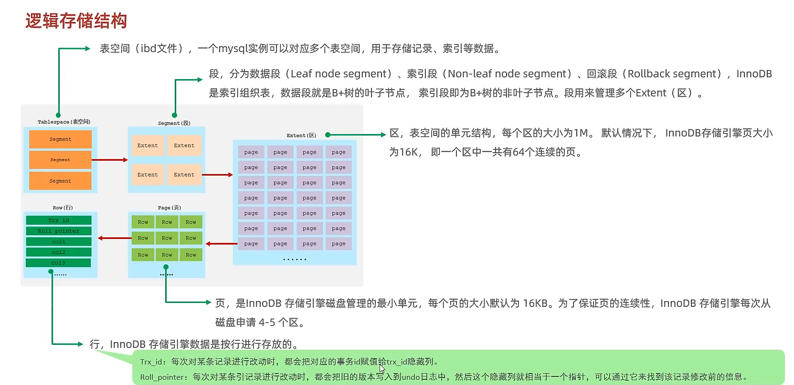

**内存结构**


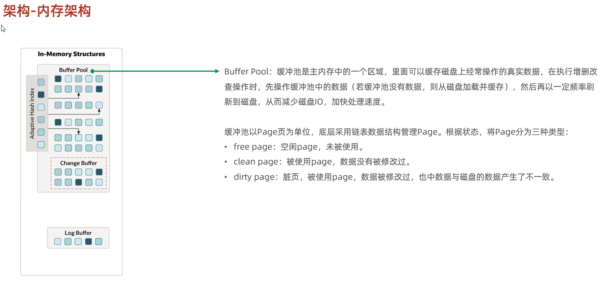

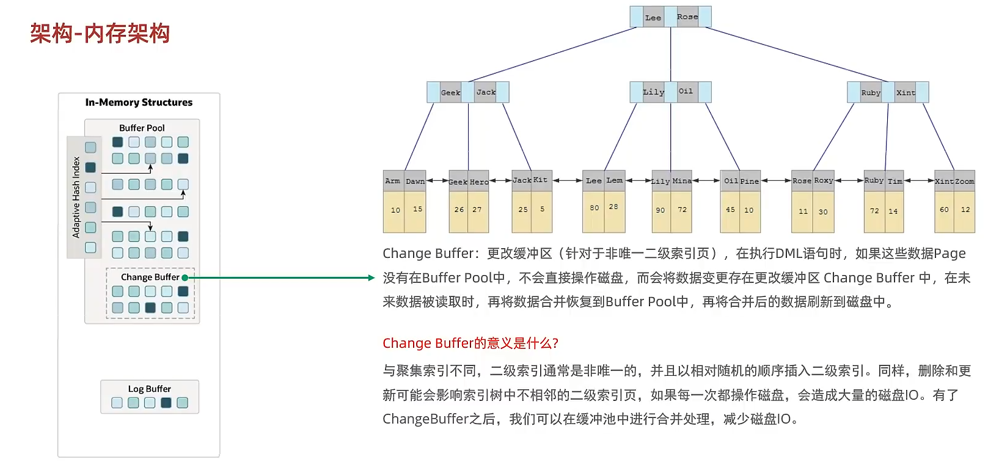

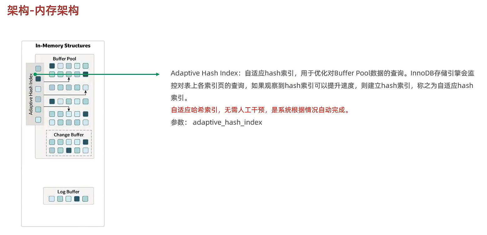

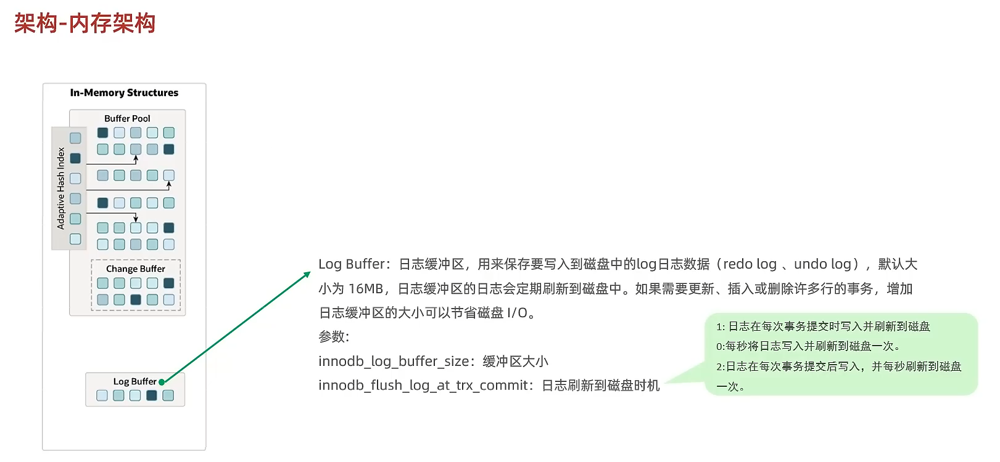


**磁盘架构**

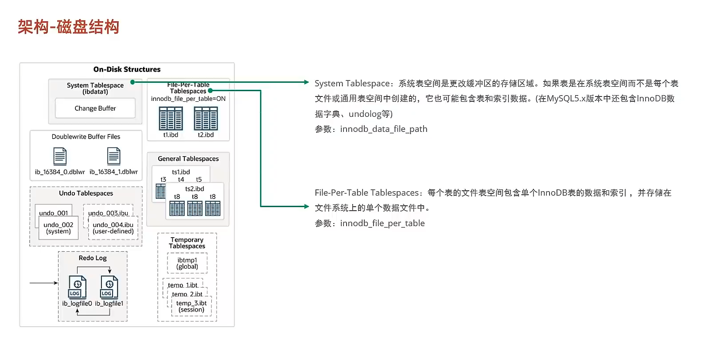

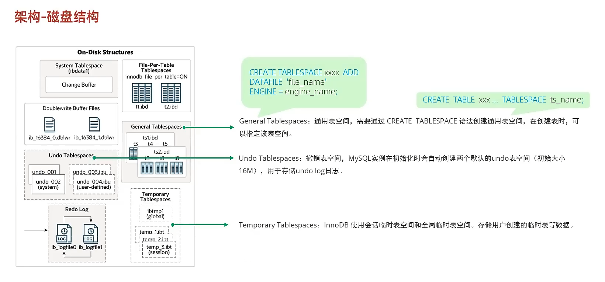

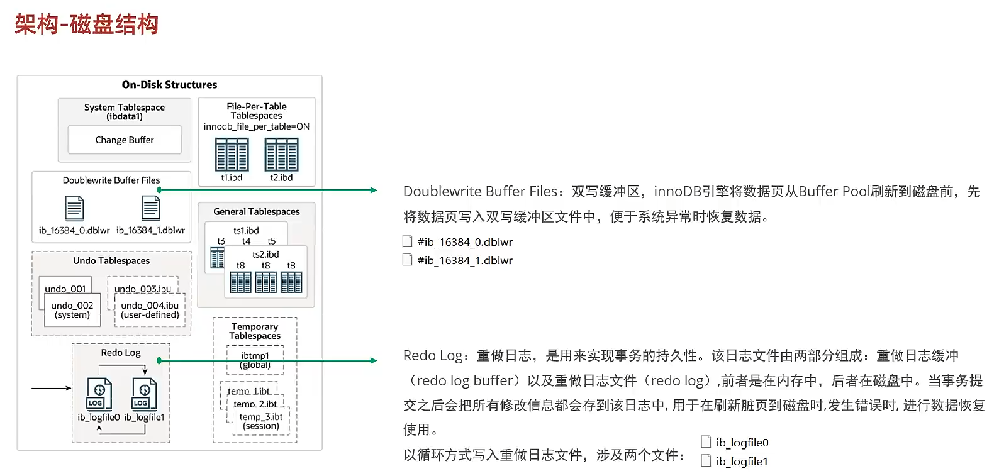


**后台线程**

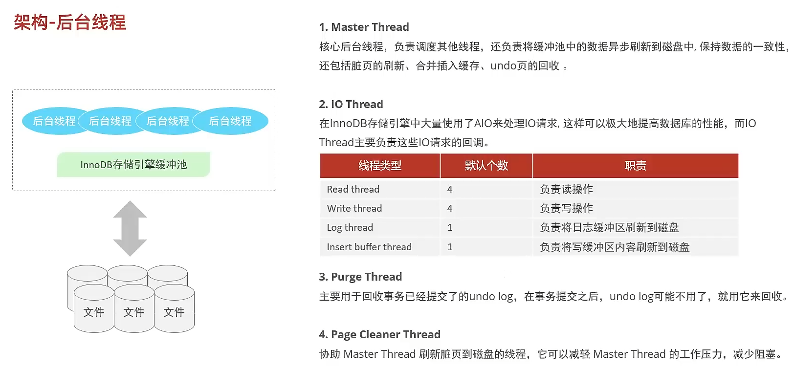


### 事务原理

事务是一组操作的集合，它是一个不可分割的工作单位，事务会把所有的操作作为一个整体一起向系统提交或撤销操作请求，即这些操作要么同时成功，要么同时失败。


**特性（ACID）**

- 原子性（Atomicity)︰事务是不可分割的最小操作单元，要么全部成功，要么全部失败。
- 一致性（Consistency):事务完成时，必须使所有的数据都保持一致状态。
- 隔离性（Isolation):数据库系统提供的隔离机制，保证事务在不受外部并发操作影响的独立环境下运行。
- 持久性（Durability):事务一旦提交或回滚，它对数据库中的数据的改变就是永久的。


#### redo log

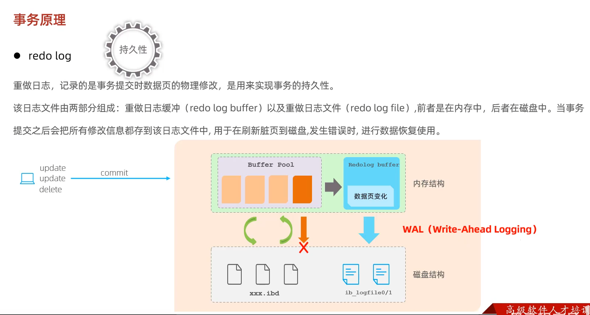


#### undo log

回滚日志，用于记录数据被修改前的信息，作用包含两个:提供回滚和MVCC(多版本并发控制)。

undo log和redo log记录物理日志不一样，它是逻辑日志。可以认为当delete一条记录时，undo log中会记录一条对应的insert记录，反之亦然，当update一条记录时，它记录一条对应相反的update记录。当执行rollback时，就可以从undo log中的逻辑记录读取到相应的内容并进行回滚。

Undo log销毁: undo log在事务执行时产生，事务提交时，并不会立即删除undo log，因为这些日志可能还用于MVCC。

Undo log存储: undo log采用段的方式进行管理和记录，存放在前面介绍的rollback segment 回滚段中，内部包含1024个undo log segment。


### MVCC

**基本概念**

- 当前读

  读取的是记录的最新版本，读取时还要保证其他并发事务不能修改当前记录，会对读取的记录进行加锁。对于我们日常的操作，如:select ... lock in share mode(共享锁)，select .. for update、update、insert、delete(排他锁)都是一种当前读。

- 快照读

  简单的select(不加锁）就是快照读，快照读，读取的是记录数据的可见版本，有可能是历史数据，不加锁，是非阻塞读。

  - Read Committed:每次select，都生成一个快照读。
  - Repeatable Read:开启事务后第一个select语句才是快照读的地方。
  - Serializable:快照读会退化为当前读。

- MVCC

  全称Multi-Version Concurrency Control，多版本并发控制。指维护一个数据的多个版本，使得读写操作没有冲突，快照读为MySQL实现MVCC提供了一个非阻塞读功能。MVCC的具体实现，还需要依赖于数据库记录中的三个隐式字段、undo log日志、readView。


**隐藏字段**

| 隐藏字段    | 含义                                                         |
| ----------- | ------------------------------------------------------------ |
| DB_TRX_ID   | 最近修改事务ID，记录插入这条记录或最后一次修改该记录的事务ID。 |
| DB_ROLL_PTR | 回滚指针，指向这条记录的上一个版本，用于配合undo log，指向上一个版本 |
| DB_ROW_ID   | 隐藏主键，如果表结构没有指定主键，将会生成该隐藏字段         |


**undo log版本链**

回滚日志，在insert、update、delete的时候产生的便于数据回滚的日志。

当insert的时候，产生的undo log日志只在回滚时需要，在事务提交后，可被立即删除。

而update、delete的时候，产生的undo log日志不仅在回滚时需要，在快照读时也需要，不会立即被删除。


**readView**

ReadView（读视图）是快照读SQL执行时MVCC提取数据的依据，记录并维护系统当前活跃的事务（未提交的）id。

Readview中包含了四个核心字段:

| 字段           | 含义                                                 |
| -------------- | ---------------------------------------------------- |
| m_ids          | 当前活跃的事务ID集合                                 |
| min_trx_id     | 最小活跃事务ID                                       |
| max_trx_id     | 预分配事务ID，当前最大事务ID+1（因为事务ID是自增的） |
| creator_trx_id | ReadView创建者的事务ID                               |

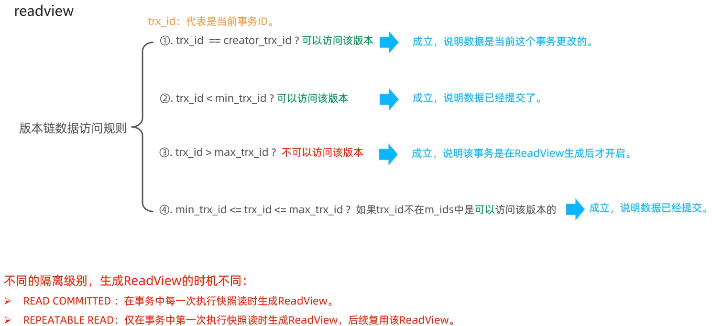


## MySQL管理

### 系统数据库

| 数据库             | 含义                                                         |
| ------------------ | ------------------------------------------------------------ |
| mysql              | 存储mysql服务器正常运行所需要的各种信息（时区、主从、用户、权限等） |
| information_schema | 提供了访问数据库元数据的各种表和视图，包括数据库，表，字段类型，及访问权限等 |
| performance_schema | 为MySQL服务器运行时状态提供了一个底层监控功能，主要用于收集数据库服务器性能参数 |
| sys                | 包含了一系列方便DBA和开发人员利用performance_schema性能数据库进行性能调优和诊断的视图 |

**mysql**

```shell
#语法：
	mysql [option] [database]
#选项：
	-u, --user=name			# 指定用户名
	-p, --password[=name]	# 指定密码
	-h, --host=name			# 指定服务器ip或域名
	-P, --port=port			# 指定连接端口
	-e, --execute=name		# 执行sql语句并退出
# 示例：
	mysql -uroot -p123456 db01 -e"select * from stu"
	# 对于一些批处理脚本非常方便
```

**mysqladmin**

mysqladmin是一个执行管理操作的客户端程序。可以用它来检查服务器的配置和当前状态、创建并删除数据库等。


**mysqlbinlog**

由于服务器生成的二进制日志文件以二进制格式保存，所以如果想要检查这些文本的文本格式，就会使用到mysqbinlog日志管理工具。

```shell
#语法：
	mysqlbinlog [options] log-files1 log-files2 ...
#选项：
	-d, --database=name			# 指定数据库名称，只列出指定数据库相关操作
	-o, --offset=n				# 忽略掉日志中前n行命令
	-r, --result-file=name		# 输出文本格式日志到指定文件
	-s, --short-form			# 简单格式，省略一些信息
	--start-datatime=date1 --stop-datetime=date2	# 指定日期间隔内的所有日志
	--start-postion=pos1 --stop-postion=pos2		# 指定位置间隔内的所有日志
```


**mysqlshow**

mysqlshow客户端对象查找工具，用来很快地查找存在哪些数据库、数据库中的表、表中的列或者索引。

```bash
#语法：
	mysqlshow [options] [db_name[table_name[col_name]]]
#选项：
	--count		# 显示数据库及表的统计信息(数据库，表均可以不指定)
	-i			# 显示指定数据库或者表的状态信息
#示例：
	# 查询每个数据库的表的数量及表中记录的数量
	mysqlshow -uroot -p1234 --count
	
	# 查询test库中每个表中的字段数，及行数
	mysqlshow -uroot -p1234 test --count
	
	# 查询test库中book表的详细情况
	mysqlshow -uroot -p1234 test book --count
```


**mysqldump**

mysqldump客户端工具用来份数据库或在不同数据库之间进行数据迁移。备份内容包含创建表，及插入表的SQL语句。

```shell
#语法：
	mysqldump [options] db_name [tables]
	mysqldump [options] --database/-B db1[ db2 db3...]
	mysqldump [options] --all-databases/-A
#连接选项：
	-u, --user=name				# 指定用户名
	-p, --password[=name]		# 指定密码
	-h, --host=name				# 指定服务器ip或域名
	-P, --Post=n				# 指定连接端口
#输出选项：
	--add-drop-database			# 在每个数据库创建语句前加上drop database语句
	--add-drop-table			# 在每个数据库创建语句前加上drop table语句，默认开启；不开启（--skip-add-drop-table）
	-n,--nocreate-db			# 不包含数据库的创建语句
	-t,--nocreate-info			# 不包含数据表的创建语句
	-d,--no-data				# 不包含数据
	-T,--tab=name				# 自动生成两个文件，一个.sql文件，创建表结构的语句，一个.txt文件，数据文件
```


**mysqlimport / source**

mysqlimport是客户端数据导入工具，用来导入mysqldump加-T参数后导出的文本文件。

```shell
#语法：
	mysqlimport [options] db_name textfile1 [textfile2]
#示例：
	mysqlimport -uroot -p1234 test /tmp/city.txt
	
# 如果需要导入sql文件，可以使用mysql命令行中的source指令：
source /root/xxxx.sql
```


# 运维

## 日志

### 错误日志

错误日志是MySQL中最重要的日志之一，它记录了当mysqld启动和停止时，以及服务器在运行过程中发生任何严重错误时的相关信息。当数据库出现任何故障导致无法正常使用时，建议首先查看此日志。

该日志是默认开启的，默认存放目录`/var/log/`，默认的日志文件名为mysqld.log 。查看日志位置:
`show variables like '%log_error%'`


### 二进制日志

二进制日志（BINLOG）记录了所有的DDL（数据定义语言）语句和DML（数据操纵语言）语句，但不包括数据查询（SELECT、SHOW）语句。
作用:

1. 灾难时的数据恢复

2. MySQL的主从复制。在MySQL8版本中，默认二进制日志是开启着，涉及到的参数如下:

   `show variables like '%log_bin%'`


### 查询日志

查询日志中记录了客户端的所有操作语句，而二进制日志不包含查询数据的SQL语句。默认情况下，查询日志是未开启的。如果需要开启查询日志，可以设置以下配置：

`show variables like '%general%'`

修改MySQL的配置文件/etc/my.cnf文件，添加如下内容：

```bash
# 该选项用来开启查询日志，可选值：0或者1，0代表关闭
general_log = 1
# 设置日志的文件名，如果没有指定，默认为host_name.log
general_log_file = mysql_query.log
```


### [慢查询日志（进阶）](#慢查询日志)

慢查询日志记录了所有执行时间超过参数long_query_time设置值并且扫描记录数不小于min_examined_row_limit的所有的SQL语句的日志，默认未开启。long_query_time默认为10秒，最小为0，精度可以到微秒。

```bash
# 慢查询日志
slow_query_log = 1
# 执行时间参数
long_query_time = 2
```

默认情况下，不会记录管理语句，也不会记录不使用索引进行查找的查询。可以使用log_slow_admin_statements和log_queries_not_using_indexes更改此行为，如下所述。

```bash
 # 记录执行较慢的管理语句
 log_slow_admin_statements = 1
 # 记录执行较慢的未使用索引的语句
 log_queries_not_using_indexes = 1
```


## 主从复制

主从复制是指将主数据库的DDL和DML操作通过二进制日志传到从库服务器中，然后在从库上对这些日志重新执行（也叫重做)，从而使得从库和主库的数据保持同步。

MySQL支持一台主库同时向多台从库进行复制，从库同时也可以作为其他从服务器的主库，实现链状复制。

优点：

1. 主库出现问题，可以快速切换到从库提供服务。
2. 实现读写分离，降低主库的访问压力。
3. 可以在从库中执行备份，以避免备份期间影响主库服务。

**原理**

主库的操作记录在binlog之中，从库IO线程发起IO请求连接主库binlog读取，并写入到从库的relay_log，再由从库的SQL线程读取relay_log再写入到从库之中

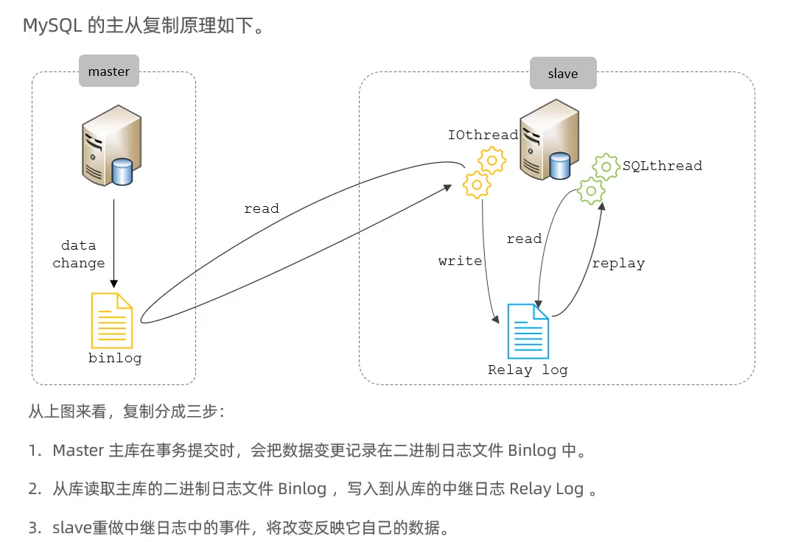


### 搭建

#### 服务器准备

##### 主库配置

1. 修改配置文件/etc/my.cnf

   ```bash
   # mysql服务id，保证整个集群环境中唯一，取值范围：1-2^31-1,默认为1
   server-id=1
   # 是否只读，1代表只读，0代表读写
   read-only=0
   # 忽略的数据，指不需要同步的数据库
   #binlog-ignore-db=mysql
   # 指定同步的数据库
   #binlog-do-db=db01
   ```

2. 重启mysql服务器

   `systemctl restart mysqld`

3. 登录mysql，创建远程连接的账号，并授予主从复制的权限

   ```mysql
   # 创建用户，并设置密码，该用户可以在任意主机连接该mysql服务
   CREATE USER 'XXX'@'%' IDENTIFIED WITH mysql_native_password BY '密码';
   # 为用户分配主从复制权限
   GRANT REPLICATION SLAVE ON *.* TO 'XXX'@'%';
   ```

4. 通过指令，查看二进制日志坐标

   `show master status;`

   字段含义说明：

   - <span id='file'>file</span>：从哪个日志开始推送日志文件
   - <span id='position'>position</span>：从哪个位置开始推送日志
   - binlog_ignore_db：指定不需要同步的数据库


##### 从库配置

1. 修改配置文件/etc/my.cnf

   ```bash
   # mysql服务id，保证整个集群环境中唯一，取值范围：1-2^31-1,和主库不能相同
   server-id=2
   # 是否只读，1代表只读，0代表读写
   read-only=1
   # 超级管理员不受上面的参数的读写限制，有单独的配置项
   super-read-only=1
   ```

2. 重启mysql服务器

   `systemctl restart mysqld`

3. 登录musql，设置主库配置

   ```mysql
   CHANGE REPLICATION SOURCE TO SOURCE_HOST='IP地址', SOURCE_USER='用户名', SOURCE_PASSWORD='密码', SOURCE_LOG_FILE='二进制日志文件', SOURCE_LOG_POS=文件起始位置;
   # 上述是8.0.23中的语法（高版本向下兼容），如果是之前的版本，执行下面的SQL:
   CHANGE MASTER TO MASTER_HOST='IP地址', MASTER_USER='用户名', MASTER_PASSWORD='密码', MASTER_LOG_FILE='二进制日志文件', MASTER_LOG_POS=文件起始位置;
   #例：
   CHANGE REPLICATION SOURCE TO SOURCE_HOST='192.168.0.2', SOURCE_USER='user', SOURCE_PASSWORD='passwd', SOURCE_LOG_FILE='binlog.00004', SOURCE_LOG_POS=663;
   
   #一开始是写死的logfile，后续他会自己变更，这里写死只是为了标志开始位置
   ```

   | 参数名                      | 含义               | 8.0.23之前      |
   | --------------------------- | ------------------ | --------------- |
   | SOURCE_HOST                 | 主库IP地址         | MASTER_HOST     |
   | SOURCE_USER                 | 连接主库的用户名   | MASTER_USER     |
   | SOURCE_PASSWORD             | 连接主库的密码     | MASTER_PASSWORD |
   | [SOURCE_LOG_FILE](#file)    | binlog文件名       | MASTER_LOG_FILE |
   | [SOURCE_LOG_POS](#position) | binlog文件起始位置 | MASTER_LOG_POS  |

4. 开启同步操作

   ```mysql
   start replica; # 8.0.22之后
   start slave; # 8.0.22之前
   
   show replica status;
   #Replica_IO_Running:Yes
   #Replica_SQL_Running:Yes
   ```

   


## 分库分表

**问题分析**

随着互联网及移动互联网的发展，应用系统的数据量也是成指数式增长，若采用单数据库进行数据存储，存在以下性能瓶颈:

1. IO瓶颈：热点数据太多，数据库缓存不足，产生大量磁盘lO，效率较低。请求数据太多，带宽不够，网络IO瓶颈。

2. CPU瓶颈：排序、分组、连接查询、聚合统计等SQL会耗费大量的CPU资源，请求数太多，CPU出现瓶颈。


**垂直拆分**

垂直分库：以表为依据，根据业务将不同表拆分到不同库中。特点：

1. 每个库的表结构都不一样
2. 每个库的数据也不一样
3. 所有库的并集是全量数据

垂直分表：以字段为依据，根据字段属性将不同字段拆分到不同表中。特点：

1. 每个表的结构都不一样
2. 每个表的数据也不一样，一般通过一列（主键/外键）关联
3. 所有表的并集是全量数据

**水平拆分**

水平分库：以字段为依据，按照一定策略，将一个库的数据拆分到多个库中。特点：

1. 每个库的表结构都一样
2. 每个库的数据都不一样
3. 所有库的并集是全量数据

水平分表：以字段为依据，按照一定策略，将一个表的数据拆分到多个表中。特点：

1. 每个表的结构都一样
2. 每个表的数据都不一样
3. 所有表的并集是全量数据


### MyCat

MyCat依赖于java，请先配置好jdk

#### 安装

```bash
tar -zxvh MyCat-server-1.x.x.x-release-xxxx.tar.gz -C /usr/local/

# 由于MyCat自身的mysql驱动包版本比较旧，需要我们自行替换
cd /usr/local/mycat/lib
rm -rf mysql-connector-java-5.xxx.jar
# 上传一个新的jdbc到这个目录
chmod 777 {新的jdbc}
```


**MyCat环境准备**

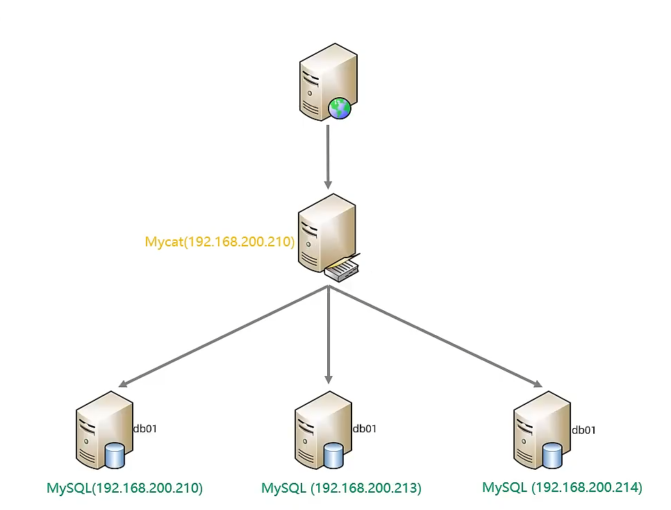


#### 配置文件

schema.xml

> 最重要的配置文件之一，涵盖了MyCat逻辑库，逻辑表，分片规则，分片节点及数据源的配置。
>
> 主要包含以下三组标签：
>
> - [schema标签](#schema标签)
> - datanode标签
> - datahost标签

```xml
<?xml version="1.0"?>
<!DOCTYPE mycat:schema SYSTEM "schema.dtd">

<mycat:schema xmlns:mycat="http://io.mycat/">
    <!--逻辑表-->
    <schema name="DB01" checkSQLschema="true" sqlMaxLimit="100">
        <table name="TB_ORDER" dataNode="dn1, dn2, dn3" rule="auto-sharding-long"/>
    </schema>
    
    <!--物理表节点 与上面的部分依照name和dataNode匹配-->
    <dataNode name="dn1" dataHost="dhost1" database="db01" /><!--database中填写实际节点中的数据库名称-->
    <dataNode name="dn2" dataHost="dhost2" database="db01" />
    <dataNode name="dn3" dataHost="dhost3" database="db01" />
    
    <!--物理表主机连接 与上面的部分依照name和dataHost匹配-->
    <dataHost name="dhost1" maxCon="1000" minCon="10" balance="0" writeType="0" dbType="mysql" dbDriver="jdbc" switchType="1" slaveThreshold="100">
    	<heartbeat> select user() </heartbeat>
        <writeHost host="master" url="jdbc:mysql://ip地址:端口?useSSL=false&amp;serverTimezone=Asin/Shanghai&amp;characterEncoding=utf8mb4" user="root" password="123456"/>
    </dataHost>
    <dataHost name="dhost2" maxCon="1000" minCon="10" balance="0" writeType="0" dbType="mysql" dbDriver="jdbc" switchType="1" slaveThreshold="100">
    	<heartbeat> select user() </heartbeat>
        <writeHost host="master" url="jdbc:mysql://ip地址:端口?useSSL=false&amp;serverTimezone=Asin/Shanghai&amp;characterEncoding=utf8mb4" user="root" password="123456"/>
    </dataHost>
    <dataHost name="dhost3" maxCon="1000" minCon="10" balance="0" writeType="0" dbType="mysql" dbDriver="jdbc" switchType="1" slaveThreshold="100">
    	<heartbeat> select user() </heartbeat>
        <writeHost host="master" url="jdbc:mysql://ip地址:端口?useSSL=false&amp;serverTimezone=Asin/Shanghai&amp;characterEncoding=utf8mb4" user="root" password="123456"/>
    </dataHost>
    
</mycat:schema>
```


server.xml

> 配置mycat用户及用户的权限信息

```xml
<user name="root" defaultAccount="true">
	<property name="password">123456</property>
    <property name="schemas">DB01</property>
    
    <!-- 表级DML权限设置 -->
    <!--
	<privileges check="false">
        <schema name="TESTDB" dml="0110">
            <table name="tb01" dml="0000"></table>
            <table name="tb02" dml="1111"></table>
        </schema>
    </privileges>
	-->
</user>

<user name="user">
	<property name="password">123456</property>			<property name="schemas">DB01</property>
    <property name="readOnly">true</property>
</user>
```


#### 启动服务

在mycat的安装目录下的bin

> 默认端口8066

```shell
#启动
mycat start

#停止
mycat stop

#连接
mysql -h mycat的ip -P 8066 -uroot -p123456
```


#### MyCat配置详解

##### schema标签

```xml
<schema name="DB01" checkSQLschema="true" sqlMaxLimit="100">
        <table name="TB_ORDER" dataNode="dn1, dn2, dn3" rule="auto-sharding-long"/>
</schema>
```

schema标签用于定义MyCat实例中的逻辑库，一个MyCat实例中，可以有多个逻辑库，可以通过schema标签来划分不同的逻辑库。

MyCat中的逻辑库的概念，等同于MySQL中database的概念，需要操作某个逻辑库下的表时，也需要切换逻辑库 (use xxx;) 。

核心属性：

- name：指定自定义的逻辑库库名
- checkSQLschema：在SQL语句操作时制定了数据库名称，执行时是否自动去除；true：自动去除，false：不自动去除
- sqlMaxLimit：如果未指定limit进行查询，列表查询模式查询多少条记录


##### schema标签(table)

table标签ing一了MyCat中逻辑库schema下的逻辑表，所有需要拆分的表都需要在table标签中定义。

核心属性：

- name：定义逻辑表表名，在该逻辑库下唯一
- dataNode：定义逻辑表所属的dataNode，该属性需要与dataNode标签中name对应；多个dataNode逗号分隔
- rule：分片规则的名字，分片规则的名字是在rule.xml中定义的
- primaryKey：逻辑表对应真实表的主键
- type：逻辑表的类型，目前逻辑表只有全局表和普通表，如果未配置，就是普通表，全局表配置为global


##### dataNode标签

```xml
<dataNode name="dn1" dataHost="dhost1" database="db01" /><!--database中填写实际节点中的数据库名称-->
<dataNode name="dn2" dataHost="dhost2" database="db01" />
<dataNode name="dn3" dataHost="dhost3" database="db01" />
```

dataNode标签中定义了MyCat中的数据节点，也就是我们通常说的数据分片。一个dataNode标签就是一个独立的数据分片。

核心属性：

- name：定义数据节点名称
- dataHost：数据库实例主机名称，引用自dataHost标签中name属性
- database：定义分片所属数据库


##### dataHost标签

```xml
<dataHost name="dhost1" maxCon="1000" minCon="10" balance="0" writeType="0" dbType="mysql" dbDriver="jdbc" switchType="1" slaveThreshold="100">
    	<heartbeat> select user() </heartbeat>
        <writeHost host="master" url="jdbc:mysql://ip地址:端口?useSSL=false&amp;serverTimezone=Asin/Shanghai&amp;characterEncoding=utf8mb4" user="root" password="123456"/>
</dataHost>
```

该标签在MyCat逻辑库中作为底层标签存在，直接定义了具体的数据库实例，读写分离，心跳语句。

核心属性：

- name：唯一标识，供上层标签使用
- maxCon/minCon：最大最小连接数
- balance：负载均衡策略，取值0，1，2，3
- writeType：写操作分发方式（0：写操作转发到第一个writeHost，第一个挂了，切换到了第二个；1：写操作随机分发到配置的writeHost）
- dbDriver：数据库驱动，支持native，jdbc


#### rule.xml

rule.xml中定义所有拆分表的规则，在使用过程中可以灵活地使用分片算法，或者对一个分片算法使用不同的参数，它让分片过程可配置化。主要包含两类标签：tableRule，Function


#### server.xml

server.xml配置文件包含了MyCat的系统配置信息，主要有两个重要的标签：system，user

##### system标签

详情请参考[资料](https://blog.csdn.net/wu2374633583/article/details/115829524)

##### user标签

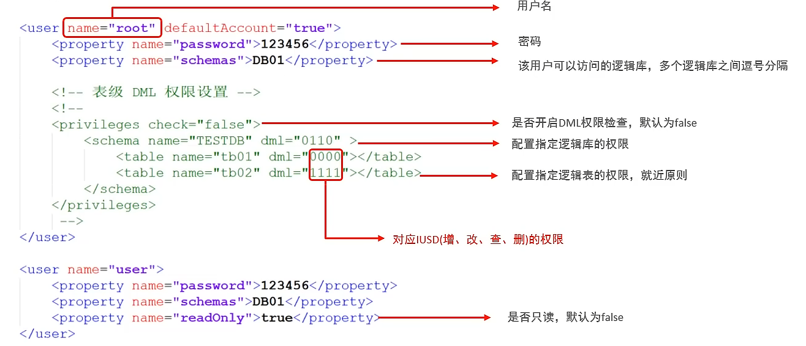


### MyCat分片

#### 垂直拆分

场景：在业务系统中，涉及以下表结构，由于用户和订单每天都会产生大量的数据，单台服务器的数据存储及处理能力是有限的，可以对数据库表进行拆分，原有的数据库表如下：

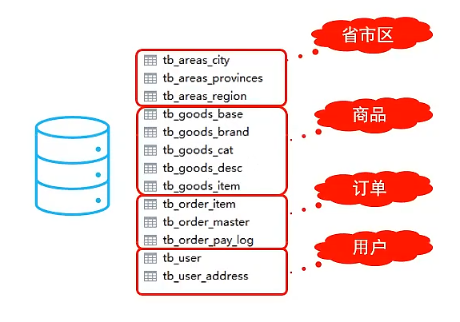

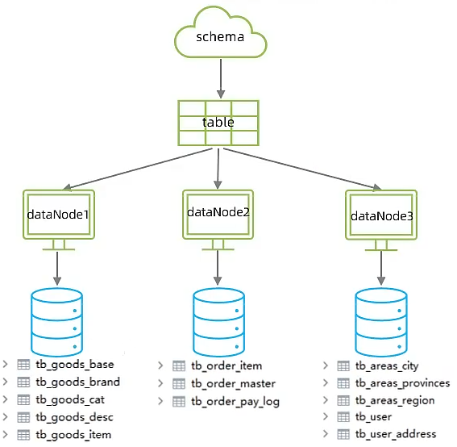

##### 配置

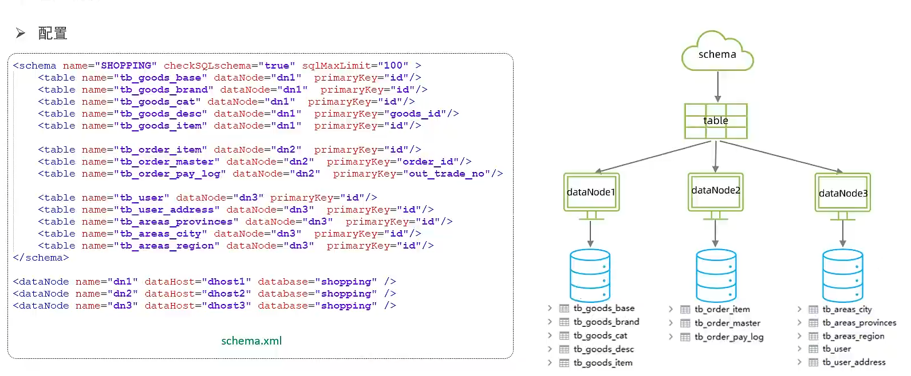

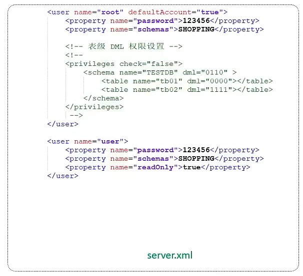

##### 测试

查询用户的收件人及收件人地址信息（包含省市区）

```mysql
select ua.user_id, ua.contact, p.province, c.city, r.area, ua.address from tb_user_address ua ,tb_areas_city c, tb_areas_provinces p, tb_areas_region r where ua.province_id = p.provinceid and ua.city_id = c.cityid and ua.town_id=r.areaid;
```

查询每一笔订单及订单的收件地址信息（包含省市区）

```mysql
SELECT order_id, payment, receiver, city, area FROM tb_order_master o, tb_areas_provinces p, tb_areas_city c, tb_areas_region r WHERE o.receiver_province=p.provinceid AND o.reciver_city=c.cityid AND o.receiver_region=r.areaid;
```

> 跨分片查询会报错，因为无法路由到对应的分片中


##### 全局表配置

对于省市区表属于数据字典表，在多个业务模块中都可能会遇到，可以将其设置为全局表，利于业务操作

schema.xml

```xml
<table name="tb_areas_provinces" dataNode="dn1, dn2, dn3" primaryKey="id" type="global"/>
<table name="tb_areas_city" dataNode="dn1, dn2, dn3" primaryKey="id" type="global"/>
<table name="tb_areas_region" dataNode="dn1, dn2, dn3" primaryKey="id" type="global"/>
```


#### 水平拆分

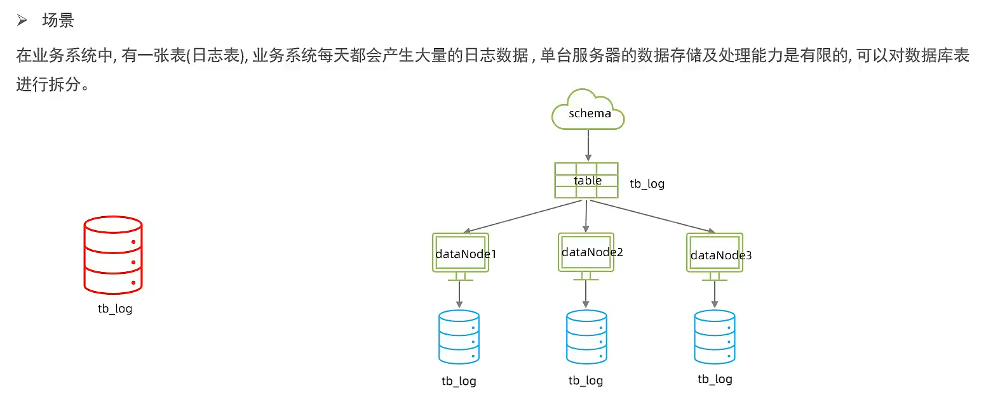

#### 分片规则

##### 范围分片

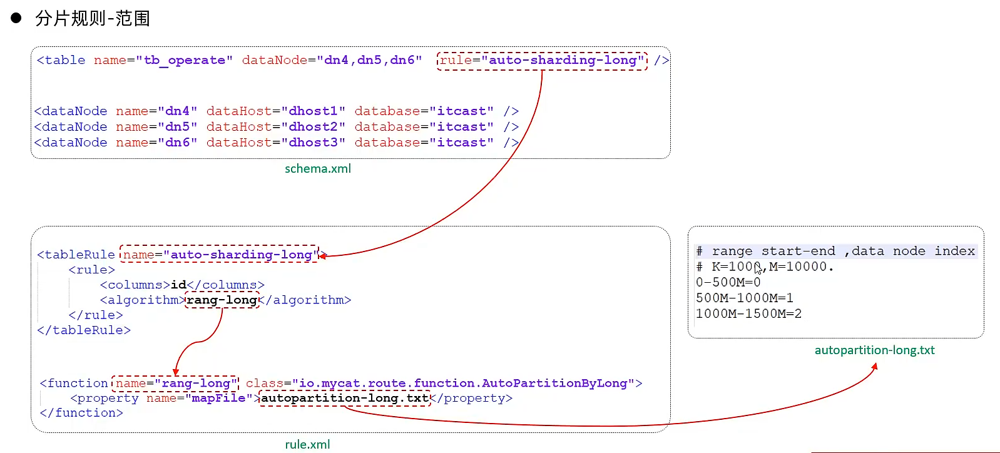

##### 取模分片

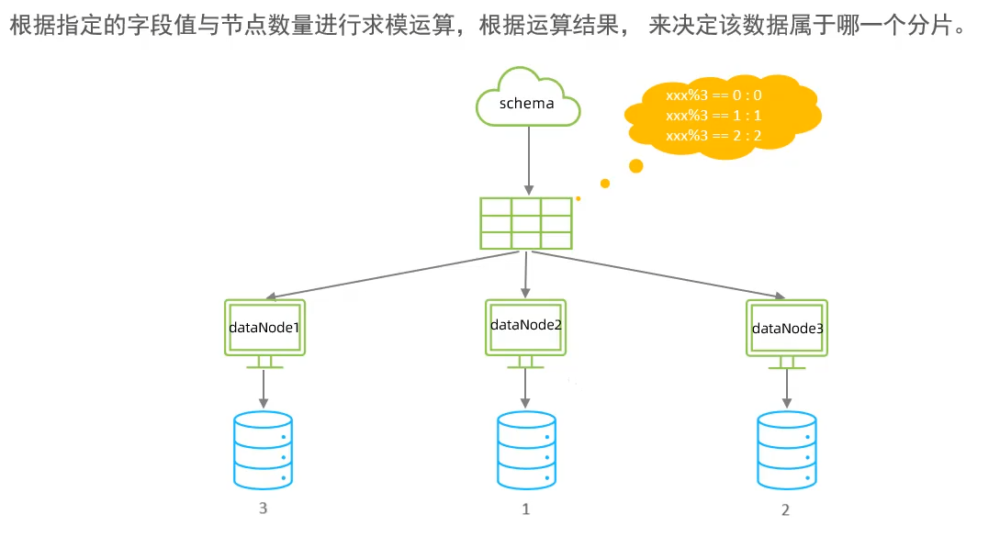

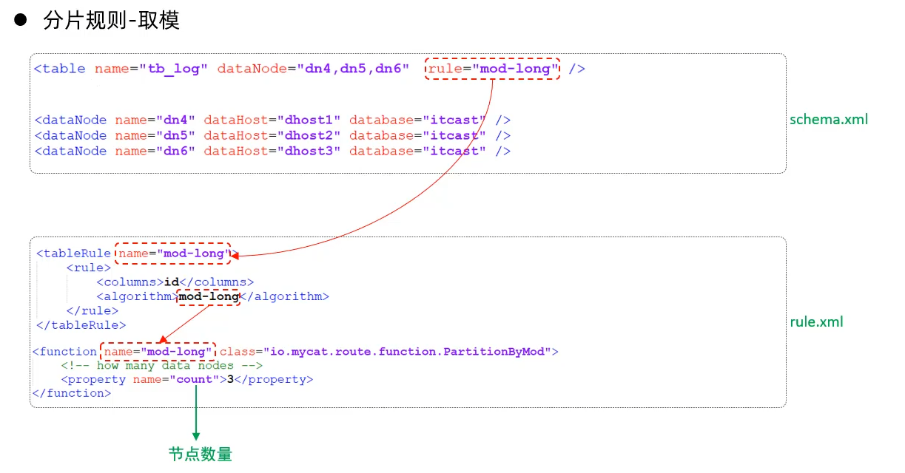

##### 一致性哈希

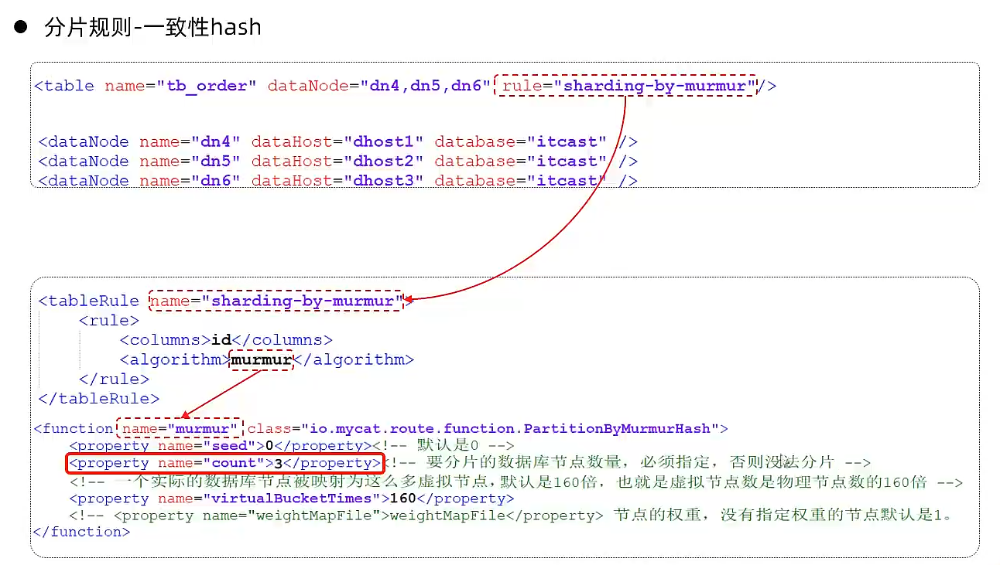

##### 枚举

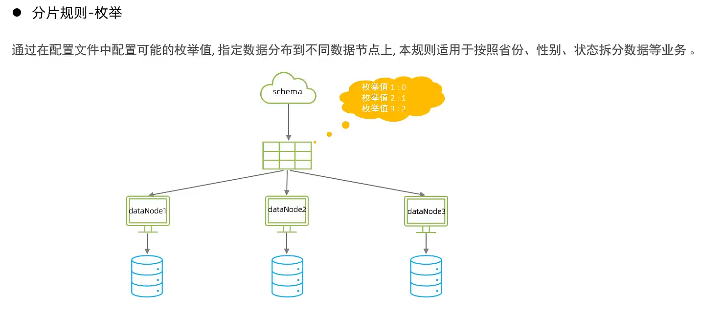

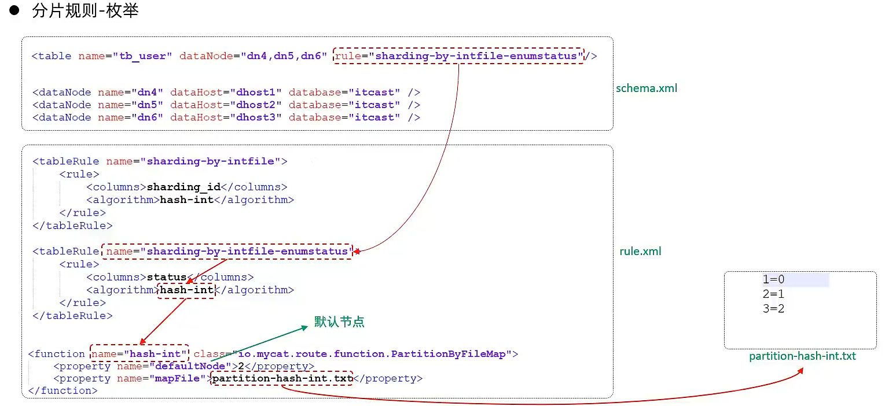


##### 应用指定

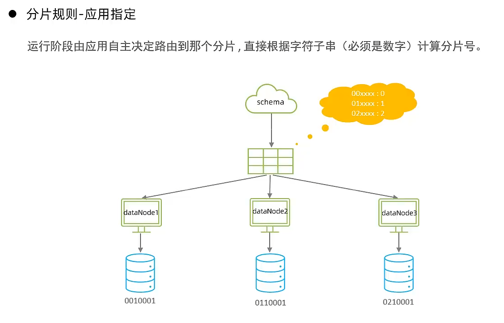

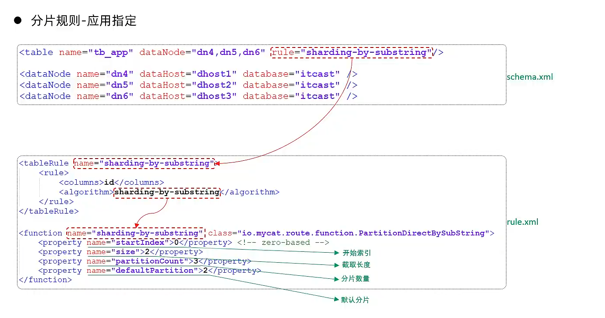

##### 固定分片哈希算法

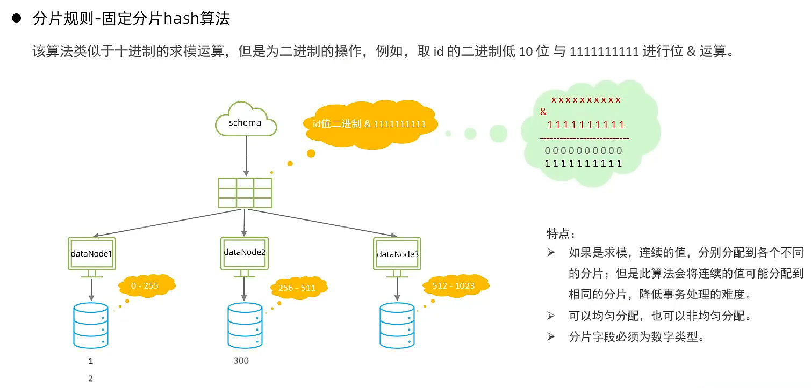

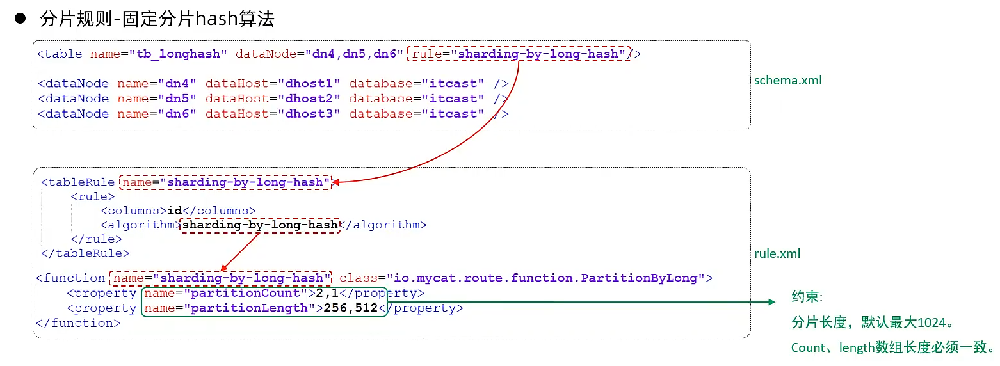

##### 按天（日期）分片


##### 按月分片

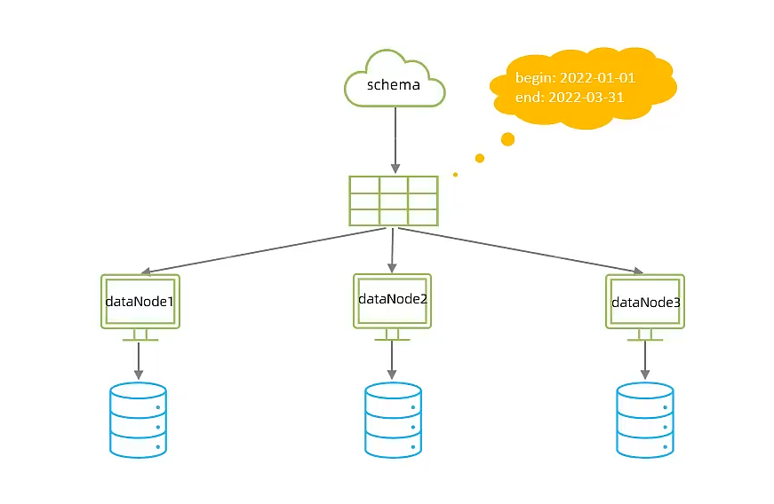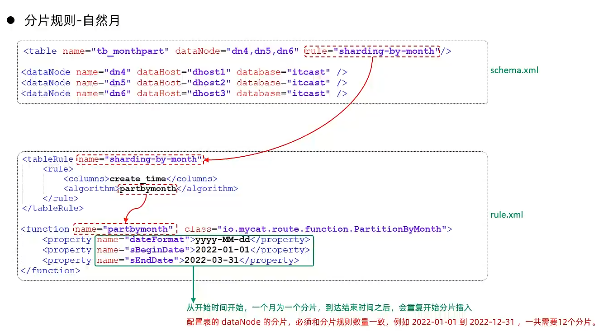


### MyCat管理及监控

MyCat默认开通2个端口，可以在server.xml中进行修改

- 8066数据访问端口，即进行DML和DDL操作。
- 9066数据库管理端口， 即MyCat服务管理控制功能，用于管理MyCat整个集群状态

```shell
mysql -h xxxx -P 9066 -u root -p
```

| 命令              | 含义                        |
| ----------------- | --------------------------- |
| show @@help       | 查看MyCat管理工具帮助文档   |
| show @@version    | 查看MyCat的版本             |
| show @@config     | 重新加载MyCat的配置文件     |
| show @@datasource | 查看MyCat的数据源信息       |
| show @@datanode   | 查看MyCat现有的分片节点信息 |
| show @@threadpool | 查看MyCat的线程池信息       |
| show @@sql        | 查看执行的SQL               |
| show @@sql.sum    | 查看执行的SQL统计           |
| reload @@config   | 重新加载配置                |


#### MyCat-eye

MyCat-web（MyCat-eye）是对mycat-server提供监控服务，功能不局限于对mycat-server使用。它通过JDBC连接对MyCat、Mysql监控，监控远程服务器（Linux）的cpu、内存、网络、磁盘。

Mycat-eye运行过程中需要依赖zookeeper，因此需要先[安装zookeeper](https://www.runoob.com/w3cnote/zookeeper-setup.html)


## 读写分离

### 概念

把读和写分离以降低服务器压力

### 配置

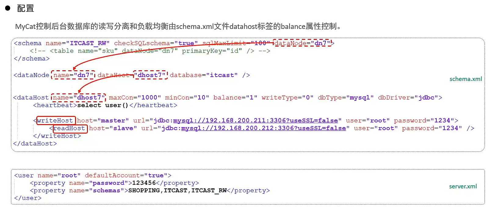

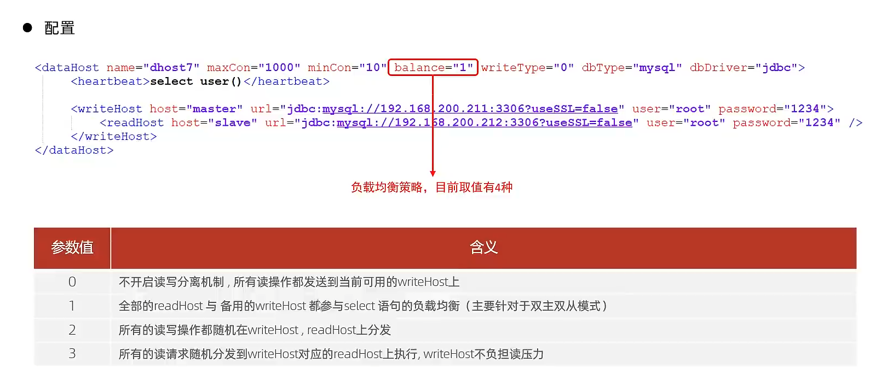


### 一主一从

主库一旦down掉，只能读不能写


### 双主双从

一个主机Master1用于处理所有的写请求，他的从机Slave1和另一台主机Master2还有它的从机Slave2处理所有读请求，当Master1宕机后，Master2主机负责处理写请求，Master1、Master2互为备机。


#### 搭建

- 主库配置（M1）

  1.修改配置文件 `/etc/my.cnf`

  ```shell
  # mysql服务ID，保证整个集群环境中唯一，取值范围：1-2^32-1，默认为1
  server-id=1
  # 指定同步的数据库
  binlog-do-db=db01
  binlog-do-db=db02
  binlog-do-db=db03
  # 在作为从数据库的时候，有写入操作也要更新二进制日志文件
  log-slave-updates
  ```

  2.重启MySQL服务器

  ```bash
  systemctl restart mysqld
  ```

- 主库配置（M2）

  与M1基本相同，唯一不同在 `server-id=3`


- 两台主库创建账号并授权

  ```mysql
  # 创建用户，并设置密码，该用户可在任意主机连接MySQL服务
  CREATE USER 'xxx'@'%' IDENTIFIED WITH mysql_native_password BY '密码';
  
  # 为用户分配主从复制权限
  GRANT REPLICATION SLAVE ON *.* TO 'xxx'@'%';
  
  # 通过指令，查看两台主库的二进制日志坐标
  SHOW master status;
  ```

  

- 从库配置（S1）

  修改配置文件`/etc/my.cnf`

  仅设置一项 `server-id=2`

  重启MySQL服务

- 从库配置（S2）

  修改配置文件`/etc/my.cnf`

  仅设置一项 `server-id=4`

  重启MySQL服务


- [两台从库配置关联的主库](#从库配置)

  ```mysql
  CHANGE MASTER TO MASTER_HOST='IP地址', MASTER_USER='用户名', MASTER_PASSWORD='密码', MASTER_LOG_FILE='二进制日志文件', MASTER_LOG_POS=文件起始位置;
  ```

- 启动两台从库的主从复制，查看从库状态

  ```mysql
  start slave;
  show slave status \G;
  # Slave_IO_Running: Yes
  # Slave_SQL_Running: Yes
  ```


- 两台主库互相复制

  Master2复制Master1，Master1复制Master2

  参考上面的主从配置


### 双主双从读写分离

**配置**

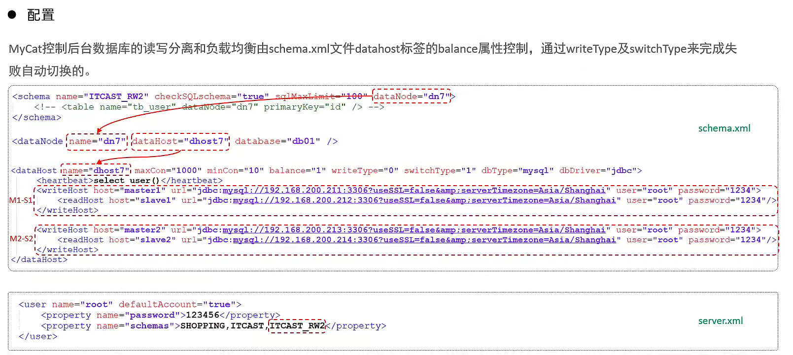

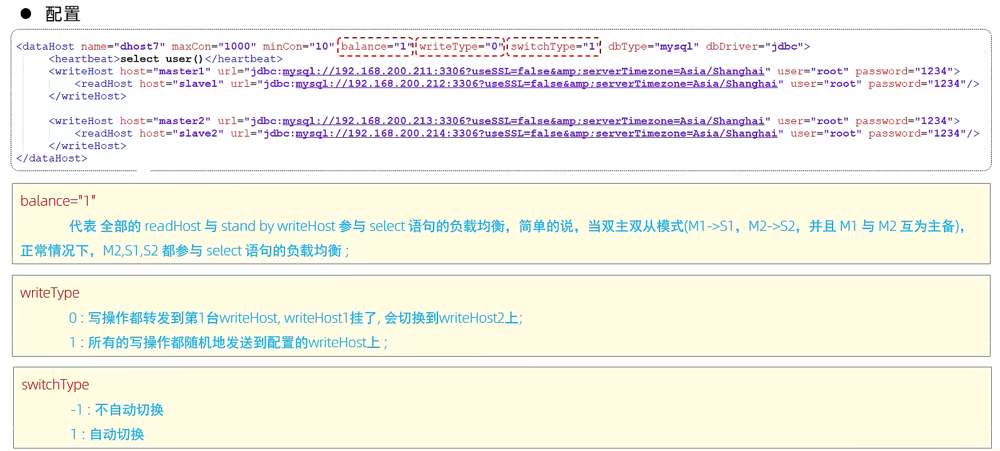


